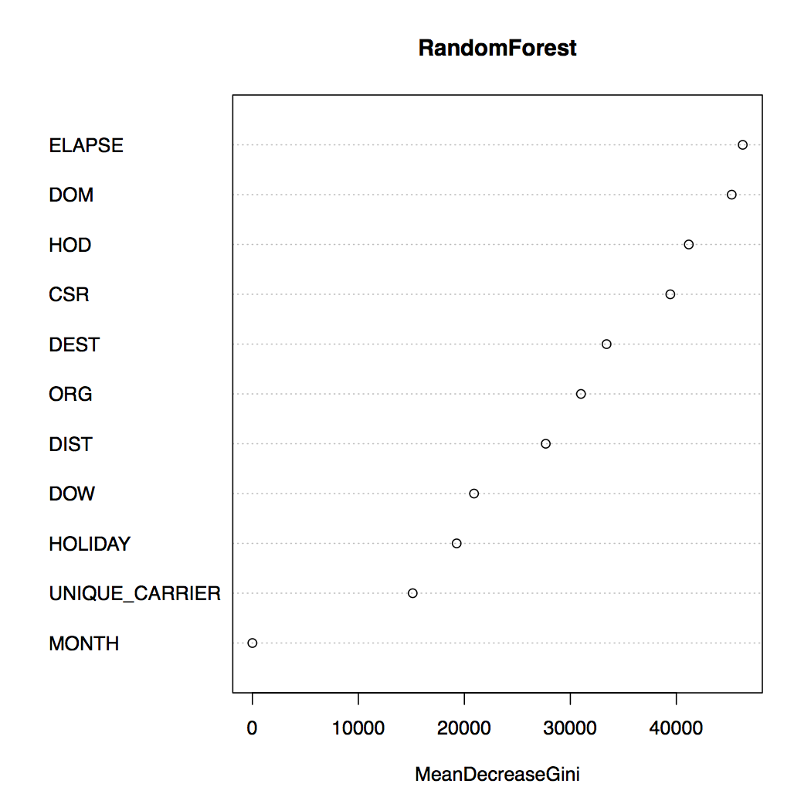
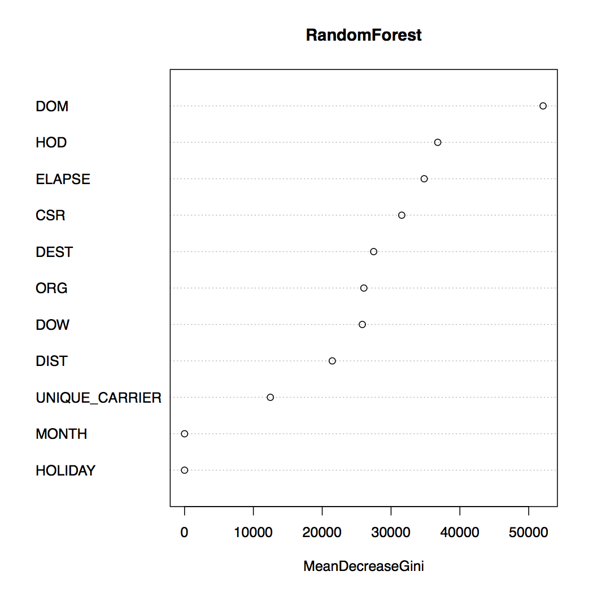
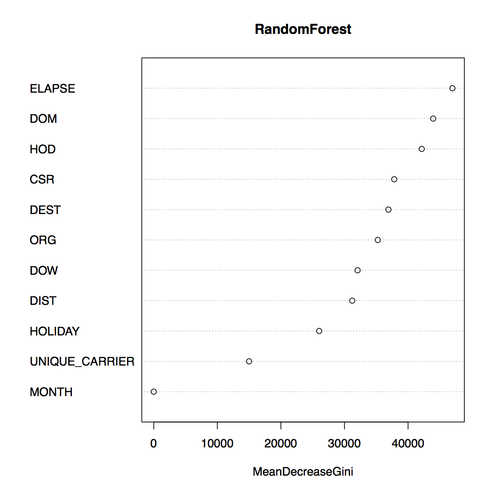
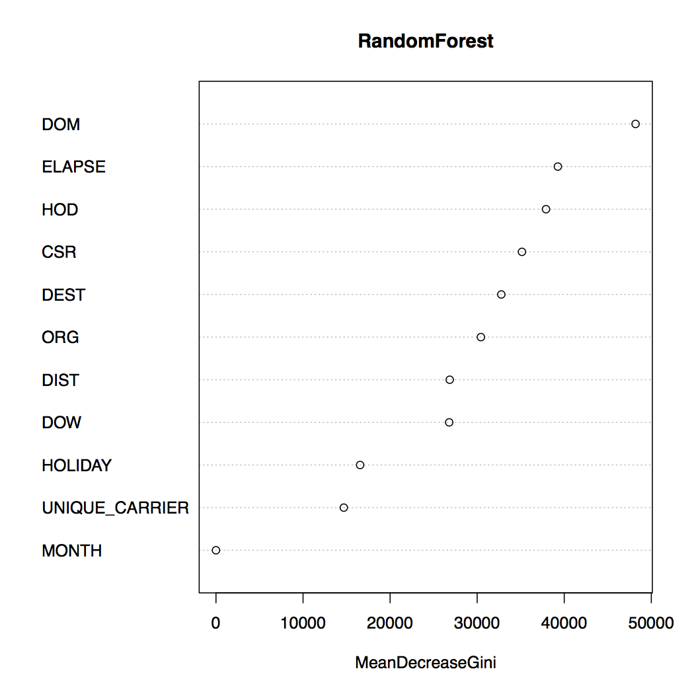

## Description:

The aim of this assignment is to predict flight delay using jistorical dataset.We are using randomforest in R to build models and train the dataset to predict whether flights given in testdata file would be on time or late . We explored 333.csv dataset to determine which variables are reasonable to use for this prediction task.Our "target" variable will be Arr_Delay_Mins (arrival delay in minutes).To build a classifier, we define a derived target variable by defining a "delay" as having 1 mins or more of delay, and "on-time" otherwise.

The factors that are considered to make prediction are as follows:
1. Month

As per our understanding, delays are more common in december as many people travel from christmas and new year so it is a good factor to consider for building model. 

2.Hour of day

```{r echo = FALSE , fig.width=4, fig.height=4 , fig.align='left'}
require(ggplot2)
require(plyr)
get_hour <- function(x) { 
  s = sprintf("%04d", as.numeric(x))
  return(substr(s, 1, 2))
}

cols = c('YEAR', 'MONTH', 'DAY_OF_MONTH', 'DAY_OF_WEEK', 'FL_DATE', 'UNIQUE_CARRIER', 'FL_NUM', 'ORIGIN','DEST', 'ARR_DELAY_NEW', 'CRS_ARR_TIME' , 'DISTANCE'); 
flights <- read.csv(file = '333.csv.gz', sep = "," , header = TRUE)[ ,cols]
df1 = flights[which( !is.na(flights$ARR_DELAY_NEW) & !is.na(flights$CRS_ARR_TIME)),]
df2 = df1[, c('ARR_DELAY_NEW', 'CRS_ARR_TIME')]
df2$hour = as.numeric(sapply(df2$CRS_ARR_TIME, get_hour))
df2$CRS_ARR_TIME <- NULL
df2 <- ddply(df2, .(hour), summarise, mean_delay=mean(ARR_DELAY_NEW))
ggplot(data=df2, aes(x=df2$hour , y=df2$mean_delay)) +  geom_bar(stat="identity") +
  xlab("Hour of day") + ylab("% of delay") +
  ggtitle("Delay by Hour of day")

```

We can see that the delay is more from 6pm till midnight . So Hour of day makes a good factor for modeling.

3.Day of Month
```{r echo = FALSE,fig.width=4, fig.height=4,fig.align='left'}
df1 = flights[which( !is.na(flights$ARR_DELAY_NEW) & !is.na(flights$DAY_OF_MONTH)),]
df2 = df1[, c('ARR_DELAY_NEW', 'DAY_OF_MONTH')]
df2$DAY_OF_MONTH = as.numeric(df2$DAY_OF_MONTH)
df2 <- ddply(df2, .(DAY_OF_MONTH), summarise, mean_delay=mean(ARR_DELAY_NEW))
ggplot(data=df2, aes(x=df2$DAY_OF_MONTH , y=df2$mean_delay)) +  geom_bar(stat="identity") +
  xlab("Day of month") + ylab("% of delay") +
  ggtitle("Delay by day of month")

```

We can see that the delay 12th of all months is the highest which makes Day of month a good factor for modeling.

4. Day of Week
```{r echo = FALSE,fig.width=4, fig.height=4,fig.align='left'}
df1 = flights[which( !is.na(flights$ARR_DELAY_NEW) & !is.na(flights$DAY_OF_WEEK)),]
df2 = df1[, c('ARR_DELAY_NEW', 'DAY_OF_WEEK')]
df2$DAY_OF_WEEK = as.numeric(df2$DAY_OF_WEEK)
df2 <- ddply(df2, .(DAY_OF_WEEK), summarise, mean_delay=mean(ARR_DELAY_NEW))
ggplot(data=df2, aes(x=df2$DAY_OF_WEEK , y=df2$mean_delay)) +  geom_bar(stat="identity") +
  xlab("Day of week") + ylab("% of delay") +
  ggtitle("Delay by day of week")

```

Delay on Monday and Friday are more which can be explained as people travel for work and holidays respectively . One of the important factors for modeling.

5.Origin
```{r echo = FALSE,fig.width=4, fig.height=4,fig.align='left'}
df1 = flights[which((flights$ORIGIN == 'DTW' | flights$ORIGIN == 'PIT' | flights$ORIGIN == 'CLT') & !is.na(flights$ARR_DELAY_NEW) & !is.na(flights$ORIGIN)),]
df2 = df1[, c('ARR_DELAY_NEW', 'ORIGIN')]
df2 <- ddply(df2, .(ORIGIN), summarise, mean_delay=mean(ARR_DELAY_NEW))
ggplot(data=df2, aes(x=df2$ORIGIN , y=df2$mean_delay )) + xlab("Origin") + ylab("% of delay") +  ggtitle("Delay by Origin") +geom_bar(stat="identity")

```

For "Origin" analysis , we have considered 3 airports namely "DTW" , "PIT" and "CLT" . Few airports are heavily crowded with many incoming and outgoing flights . From the above plot we can see that delay at DTW is more than other 2 airports.

6. Destination
```{r echo = FALSE,fig.width=4, fig.height=4,fig.align='left'}
df1 = flights[which((flights$DEST == 'DTW' | flights$DEST == 'PIT' | flights$DEST == 'CLT') & !is.na(flights$ARR_DELAY_NEW) & !is.na(flights$ORIGIN)),]
df2 = df1[, c('ARR_DELAY_NEW', 'DEST')]
df2 <- ddply(df2, .(DEST), summarise, mean_delay=mean(ARR_DELAY_NEW))
ggplot(data=df2, aes(x=df2$DEST , y=df2$mean_delay )) + xlab("Destination") + ylab("% of delay") +
  ggtitle("Delay by Destination") +geom_bar(stat="identity")

```
For "Destination" analysis , we have considered 3 airports namely "DTW" , "PIT" and "CLT" . Few airports are heavily crowded with many incoming and outgoing flights . From the above plot we can see that delay at DTW is lesser than other 2 airports.

7. Distance
```{r echo = FALSE,fig.width=4, fig.height=4,fig.align='left'}
df1 = flights[which((flights$DEST == 'DTW' | flights$DEST == 'PIT' | flights$DEST == 'CLT') & !is.na(flights$ARR_DELAY_NEW) & !is.na(flights$ORIGIN)),]
df2 = df1[, c('ARR_DELAY_NEW', 'DISTANCE')]
df2 <- ddply(df2, .(DISTANCE), summarise, mean_delay=mean(ARR_DELAY_NEW))
ggplot(data=df2, aes(x=df2$DISTANCE , y=df2$mean_delay )) + xlab("Distance in miles") + ylab("% of delay") +  ggtitle("Delay by Distance") +geom_bar(stat="identity")

```

From the above plot delay around 500 miles is higher than long distance flights . 

8. Days from Holidays
This is one of the important factors to be considered for modeling because air traffic is highest during holidays which may cause delay . 

9. Carrier
```{r echo = FALSE,fig.width=4, fig.height=4,fig.align='left'}
df1 = flights[which( !is.na(flights$ARR_DELAY_NEW) & !is.na(flights$UNIQUE_CARRIER)),]
df2 = df1[, c('ARR_DELAY_NEW', 'UNIQUE_CARRIER')]
df2 <- ddply(df2, .(UNIQUE_CARRIER), summarise, mean_delay=mean(ARR_DELAY_NEW))
ggplot(data=df2, aes(x=df2$UNIQUE_CARRIER , y=df2$mean_delay )) + xlab("Carrier") + ylab("% of delay") +
  ggtitle("Delay by Carrier") +geom_bar(stat="identity")

```
Few carriers have a bad reputation for flight delay . From the plot DL , WN , HP , UA and AA have highest delays.


\pagebreak


# Mapreduce Impelementation:

We have 3 mapreduce jobs running in sync. 1 for each of the input, the test and the validate files.
All the jobs implement multiple outputs to write year and month data to different files. The files are named according to the year and the month. 

After the individual files are written, we call a multithreaded R script on each month to calculate the model and predict the output. We decided to run a multithreaded code as the outputs were independent of each other.

## Runtime:
We could only run our code in pseudo mode. We could not run it on AWS. The whole program too 10 minutes to run on a mac machine with 2.7 GHz Intel Core i5 processor and 8 gigs of RAM.


# R Implementation

We used the randomforest library to get the model and predict the outputs.
As discussed earlier, we used few properties which according to us and our research were mostly impacting the delay of the flights.

Below are plots of few months data : MeanDecreaseGini plots

Definition: MeanDecreaseGini is a measure of variable importance based on the Gini impurity index used for the calculation of splits during training. 

As per our understanding, this index tells us what is the relative importance of each attribute in the model.If we remove that particular feature, how will the model will be affected.

## January



\pagebreak

## April


\pagebreak

## October

\pagebreak

## November

\pagebreak

## December

\pagebreak


As we see from the plots, in all the months, the arrangement of the features on the graph is the same. So according to our model we can conclude that the Elapsed time is the most affecting feature in out model and the month is the least.

Also, we can see that the Day of month is most affecting feature for the moth of november. We also dont see any major impact due to closeness to holidays. There are some variation in the April month data. Here, the day of the month and hour of day are more impacting.


# Confusion Matrix and error percentages:

## Monthwise calculation:

Month     | Actual Count | True Count   | False Count  | T Pred for F | F Pred For T | pred Ontime  | predLate    | total error --------- | ------------ | ------------ | ------------ | ------------ | ------------ | ------------ | ----------- | ------------ 
Jan       | 188659       | 99289        | 89370        | 88969        | 333          | 0.9          | 0           | 0.47         
Feb       | 200794       | 106052       | 94742        | 91375        | 2777         | 0.86         | 0.03        | 0.47         
Mar       | 228631       | 120521       | 108110       | 104319       | 3567         | 0.87         | 0.03        | 0.47         
Apr       | 221310       | 111236       | 110074       | 93671        | 12837        | 0.84         | 0.12        | 0.48         
May       | 224157       | 117817       | 106340       | 102421       | 3036         | 0.87         | 0.03        | 0.47         
June      | 217351       | 124357       | 92994        | 80947        | 12349        | 0.65         | 0.13        | 0.43         
July      | 227828       | 112367       | 115461       | 98616        | 11390        | 0.88         | 0.1         | 0.48         
Aug       | 232486       | 114626       | 117860       | 114398       | 2055         | 1            | 0.02        | 0.5          
Sept      | 188659       | 111236       | 126233       | 121232       | 2511         | 1.31         | 0.02        | 0.57         
Oct       | 218673       | 107290       | 117917       | 111900       | 4347         | 1.04         | 0.04        | 0.52         
Nov       | 213765       | 94436        | 119329       | 111864       | 4358         | 1.18         | 0.04        | 0.54         
Dec       | 203972       | 116921       | 87051        | 84673        | 1914         | 0.72         | 0.02        | 0.42         


